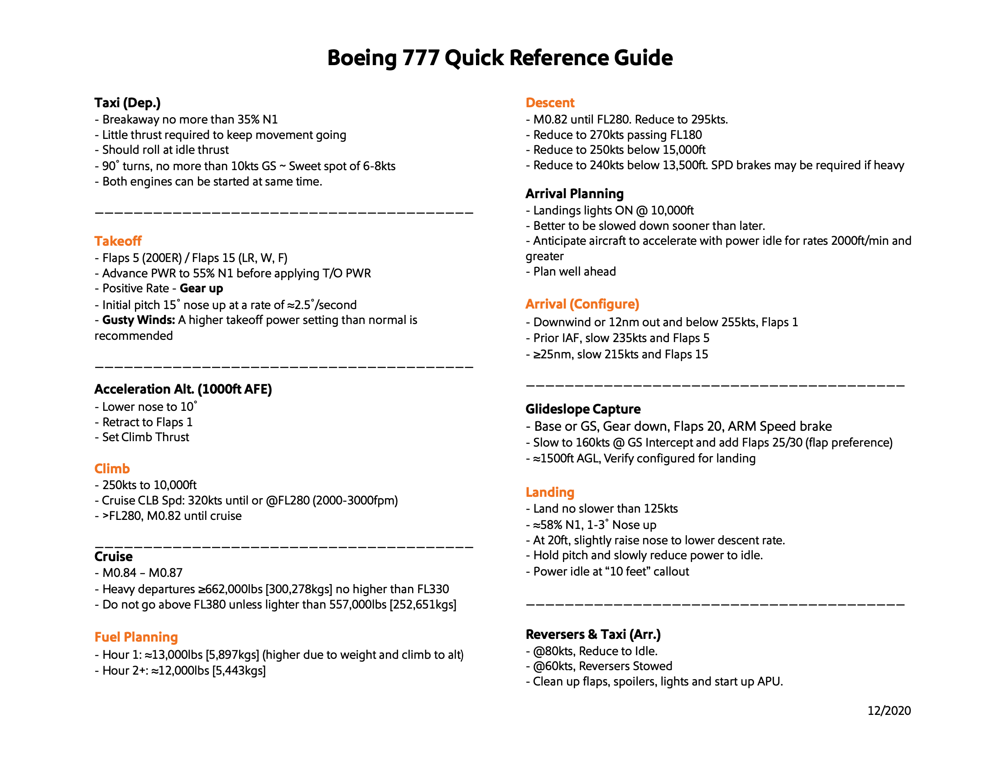

# N855FD

[[VABot 777-200F Reference]]

- > HEX: `abba6c`
- > Serial: `37726`

---

[[Forums/Unofficial Takeoff and Landing Profiles [777 Family] - Community Tutorials - Infinite Flight Community 2]]

## Takeoff

| **Load %** | **Takeoff Power** | **Takeoff Flaps** | **Rotate** | **Airborne by** | **Landing Flaps** | **Final Approach ‡** | **Flare** |
| ---------- | ----------------- | ----------------- | ---------- | --------------- | ----------------- | -------------------- | --------- |
| 25%        | 75% = 87% N1      | Flaps 5           | 135kts     | 155kts          | Flaps 30          | 135kts               | 130kts    |
| 50%        | 78% = 90% N1      | Flaps 5 / 15      | 145kts     | 170kts          | Flaps 30          | 145kts               | 140kts    |
| 75%        | 81% = 92% N1      | Flaps 15**        | 155kts     | 175kts          | Flaps 30          | 160kts               | 155kts    |
| 75%***     | 84% = 95% N1      | Flaps 15**        | 160kts+    | 175kts+         | Flaps 30          | 165kts-170kts        | 160kts+   |

# Documentation

[Aircraft Inquiry](https://registry.faa.gov/AircraftInquiry/Search/NNumberResult?nNumberTxt=855FD)

[N855FD FedEx Express Boeing 777-FS2](https://www.planespotters.net/airframe/boeing-777f-n855fd-federal-express-fedex/34j9d0)

[N855FD Flight Tracking and History - FlightAware](https://flightaware.com/live/flight/N855FD)

[N855FD - Boeing 777-FS2 - FedEx - Flightradar24https://www.flightradar24.com › data › aircraft › n855fd](https://www.google.com/url?sa=t&rct=j&q=&esrc=s&source=web&cd=&ved=2ahUKEwikloPDk_n7AhVlLH0KHQh9CDcQFnoECAwQAQ&url=https%3A%2F%2Fwww.flightradar24.com%2Fdata%2Faircraft%2Fn855fd&usg=AOvVaw1wS1LPC5kOfGCCtGDEzwhm)

[Airfleets aviation](https://www.airfleets.net/ficheapp/plane-b777-37726.htm)

[ADS-B Exchange - track aircraft live](https://globe.adsbexchange.com/?icao=abba6c)

[Aircraft Inquiry.pdf](N855FD.assets/Aircraft%20Inquiry.pdf)

